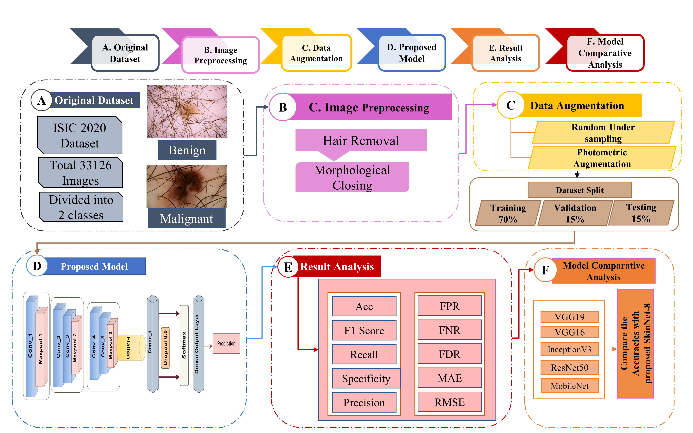

# An Efficient CNN Architecture for Classifying Skin Cancer on an Imbalanced Dataset

📚 This repository contains the original implementation of SkinNet-8: An Efficient CNN Architecture for Classifying Skin Cancer on an Imbalanced Dataset.

📧 **Contact**: For inquiries, you can reach out to us at rhslion34@gmail.com.

## Dataset Availability

This project uses the following dataset for Skin Cancer Images:

- [ISIC Challenge Dataset](https://challenge.isic-archive.com/data/#2026)

## Code

You can find the implementation of SkinNet-8 in the following file:

- [SkinNet-8 Skin Cancer Classification.ipynb](Model/SkinNet-8%20Skin%20Cancer%20Classification.ipynb)

## Paper Framework

🖼️ **PIPELINE**:

## Copying

This code is shared for research use only. If you encounter any issues or find inappropriate content in this code, please feel free to contact us.

